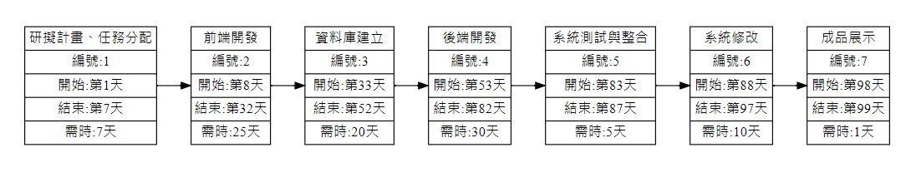
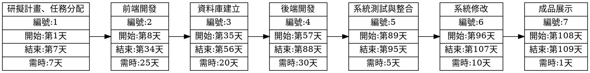

# 2022-3B Group 4 系統分析與設計

##### 小組作業 1: 顯示在小組的github 上，請列出專案的組長與組員之姓名，個別組員的任務，專題題目，內容，甘特圖與PERT/CPM圖 (期限: B班10/11)

---

| **職位** | **姓名** | **任務** |
| :---- |:--------:| -----:|
| **組長** | 周瑪麗 | 研擬計畫、前端開發、系統測試 |
| 組員 | 陳秉威 | 研擬計畫、前端開發、系統修改 |
| 組員 | 楊福男 | 研擬計畫、後端開發、系統修改 |
| 組員 | 彭興宏 | 研擬計畫、後端開發、資料庫建立 |
| 組員 | 柳欣妤 | 研擬計畫、後端開發、系統測試 |

---
### 專題題目
* 還敢不辦車證阿!(暫定，之後可以做其他延伸)

* RGB Color Generator
---
### 內容

幫助檢查車證的志工可以更快地檢查機車車主是否有辦車證，不用一個一個檢查車證貼在何處。

---
### 甘特圖

---
### PERT/CPM圖

