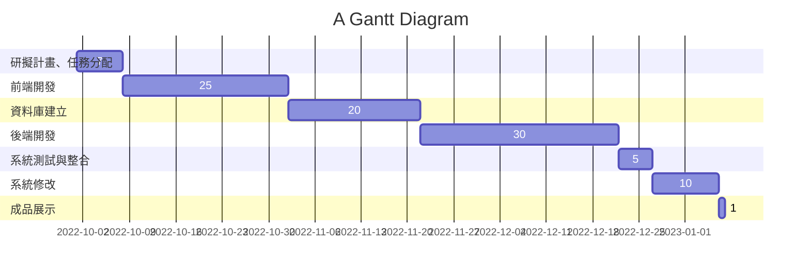
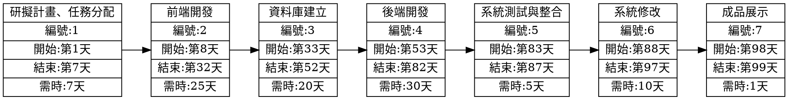

# 2022-3B Group 4 系統分析與設計

##### 小組作業 1: 顯示在小組的github 上，請列出專案的組長與組員之姓名，個別組員的任務，專題題目，內容，甘特圖與PERT/CPM圖 (期限: B班10/11)

---

| **職位** | **姓名** | **任務** |
| :---- |:--------:| :----:|
| **組長** | 周瑪麗 | 研擬計畫、任務分配、前端開發、系統測試與整合、成品展示 |
| 組員 | 陳秉威 | 研擬計畫、前端開發、系統修改、成品展示 |
| 組員 | 楊福男 | 研擬計畫、後端開發、系統修改、成品展示 |
| 組員 | 彭興宏 | 研擬計畫、後端開發、資料庫建立、成品展示 |
| 組員 | 柳欣妤 | 研擬計畫、後端開發、系統測試、成品展示 |

---
### 專題題目
* 還敢不辦車證阿!(暫定，之後可以做其他延伸)

* RGB Color Generator
---
### 內容

幫助檢查車證的志工可以更快地檢查機車車主是否有辦車證，不用一個一個檢查車證貼在何處。

---
### 甘特圖

---
### PERT/CPM圖

##### 小組作業2: 請各組新增以下五項工作
1.至少各三項的功能性需求與非功能性需求

2.呈現功能分解圖(functional decomposition diagram, FDD)

3.寫出如ppt p20 的需求分析的文字描述

4.畫出 使用案例圖 與 三個以上的 使用案例說明 (如 ppt p14)

5.使用Figma劃出第一個使用案例的動態模擬畫面

---
### 功能性需求
* 辨識車牌 

* 核對資料&檢查該車輛是否有辦車證

* 紀錄未辦車證的車牌號碼(違規次數)
### 非功能性需求
* 快速檢查車證(效能)

* 減少工作人員的工作量(效能)

* 提供機器的維護(維護性)

---
### 功能分解圖(functional decomposition diagram, FDD)

---
### 需求分析的文字描述
一個辨識車證管理系統的需求分析簡述如下：

(1) 檢查者可以藉由載入車牌號碼清單資料來產生資料表。

(2) 檢查者可以藉由系統辨識載入以及儲存車牌號碼資料。

(3) 檢查者紀錄現場的違規車牌。

(4) 任何紀錄必須更新資料。

(5) 假如該車輛違規，檢查者必須查核該車輛資料(違規次數)。

---
### 使用案例圖&三個以上的使用案例說明

---
### Figma-第一個使用案例的動態模擬畫面
